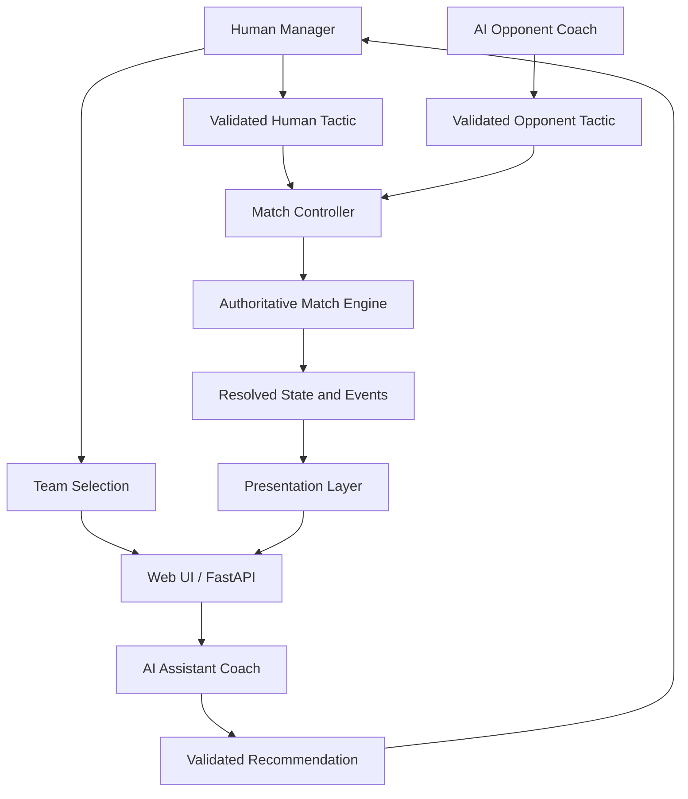

# Architecture

## Status

This document records the released v0.2.0 architecture and its responsibility
boundaries.

## Core Principle

The Match Engine is the single authority for match consequences. Agents and the
Human Manager may choose inputs such as tactics and behavior, but they never
choose goals, scores, or outcomes.

```text
Decision sources
      |
Validation and orchestration
      |
Authoritative Match Engine
      |
Resolved state and events
      |
Presentation
```

No second Match Engine or outcome path is allowed.

## v0.1.0 Historical Baseline

The published `v0.1.0` implementation contains:

- one in-memory match between two fictional teams;
- a deterministic Match Controller;
- Groq-backed CoachAgent and CognitiveFootballer decisions;
- deterministic fallback decision logic;
- one seeded probabilistic Match Engine;
- a FastAPI/Jinja2 browser interface;
- presentation-only timed playback;
- in-memory provider usage tracking.

`v0.1.0` remains the historical public baseline. The sections below describe
the released `v0.2.0` architecture.

## Team Selection

`WebMatchSession` owns the selected human side for the current in-memory match.
It exposes the two existing teams, derives the opponent, and rejects match
start until one side is selected. Reset after full time creates a new match and
clears the selection.

Selection does not reorder `team_a` and `team_b`, reconstruct team attributes,
or pass a new value into the Match Engine. This preserves the existing seeded
simulation behavior. The browser renders session state but is not the authority
for whether a match may start.

## Coaching Roles

`WebMatchSession` stores the Human Manager tactic separately from the current
resolved team tactic. Before a block, it passes the stored choice to the Match
Controller for the selected side.

The Match Controller uses that human decision without consulting the selected
side's CoachAgent. It continues to consult the opposing CoachAgent exactly once
for the block. `AssistantCoach` uses the same bounded context and validation
rules to produce advice, but its output is stored only as a recommendation and
is never applied automatically.

Both coaching agents receive a decision prompt plus five local read-only tool
schemas. The model may request score, phase, own energy, opponent energy, or
current tactic. Application code executes requested lookups against the
perspective-specific `CoachContext`, returns structured results to Groq, and
validates the final response with `CoachDecision`. The context itself is not
sent wholesale to the model.

The existing CognitiveFootballers continue through their unchanged decision
path after both team tactics have been resolved.

## Footballer Decision Composition

Each team currently has one `CognitiveFootballer`, three deterministic
`TacticalFootballer` decision makers, and seven deterministic
`ReactiveFootballer` decision makers. The CognitiveFootballer uses Groq with a
deterministic tactical fallback; it does not make the other ten players into
LLM agents.

All 11 decision makers select only an existing abstract Footballer behavior.
The Match Controller applies those choices to Footballers, and the authoritative
Match Engine aggregates their bounded attack and defense modifiers. There is no
individual-action simulation, cognitive-player allocation, or configurable
LLM-player budget in the current architecture.

## v0.2.0 Responsibility Model



The diagram defines the implemented ownership and data direction without
introducing an additional framework.

## Human Manager

- selects one fictional team;
- receives an AI Assistant recommendation;
- chooses the human team's valid tactic;
- advances the match through approved interaction points.

The Human Manager is not an AI agent.

## AI Assistant Coach

- chooses whether to request approved read-only context through local tools;
- recommends one existing valid tactic with a short reason;
- returns structured, validated output;
- cannot apply the tactic or affect MatchState directly.

## AI Opponent Coach

- chooses whether to request approved read-only context through local tools;
- selects one existing valid tactic autonomously;
- returns structured, validated output;
- cannot affect MatchState directly.

## Match Controller

The Match Controller is deterministic application code. It:

- manages match phases and interaction boundaries;
- builds bounded decision contexts;
- validates decisions;
- supplies approved inputs to the Match Engine;
- applies resolved results to MatchState;
- updates energy and structured events;
- manages match completion.

It does not implement a competing outcome model.

## Match Engine

The Match Engine:

- calculates effective attack and defense;
- applies energy, tactic, and behavior modifiers;
- applies seeded randomness;
- resolves abstract `CHANCE` and `GOAL` outcomes for each block.

It does not currently resolve assists, cards, substitutions, goalkeeper saves,
injuries, or fouls. Because these are not domain events, the presentation layer
must not manufacture them.

Existing calibrated values remain unchanged unless a separate calibration task
explicitly approves a change.

## Match State

Match State remains small and serializable. It contains only information needed
to answer the current match situation, including minute, score, phase, tactics,
team strength, energy, and previous block result.

Team selection and human-control ownership may be represented by application
state, but they must not create another source of match outcomes.

## Presentation Layer

FastAPI serves one Jinja2 page and a small JSON API. Vanilla JavaScript renders
the serialized state and invokes application actions. Browser code does not
duplicate simulation rules.

The Match Engine resolves each block once. The presentation builder may assign
seeded display timestamps and abstract narrative messages after resolution.
Presentation events cannot alter score, energy, tactics, behaviors,
probabilities, or MatchState.

### 2D Match Visualizer

The visualizer is split into three presentation-only pieces:

- `app/web/visualizer.py` maps resolved event types to a small visual contract;
- `static/js/match-visualizer.js` renders that contract with predefined SVG
  positions and movements;
- `static/css/match-visualizer.css` owns field and animation styling.

The contract contains team labels, a presentation-only starting formation, and
visual frames. The formation is a mirrored 4-3-3 marker layout with each team
in its own half; it is not a tactical or positional model. A frame is one of
`NEUTRAL`, `PRESSURE`, `CHANCE`, or `GOAL`, with an optional team side for
animation direction. The contract contains no probabilities, possession,
physics, or decision inputs.

The browser advances a neutral movement pattern during timed playback and
applies event frames already attached to the resolved timeline. Player markers
are visual tokens rather than autonomous Footballers. Replacing the component
requires no change to the Match Engine, agent code, or domain MatchState.

The browser has two presentation modes. Management Mode is a compact pre-match
workspace; Match Center is a foreground surface for score, field, scrollable
event and decision panels, progress, energy, Human Manager controls, and match
actions. Wide monitors retain the field-and-sidebar arrangement. Medium
desktops may give the field a full-width row with panels below it. Short desktop
viewports use Compact Match Center, which returns panels to the field's side
and sizes the pitch from the available match height. These responsive layouts
preserve the `100 x 60` view-box ratio without changing player coordinates.
Mobile layouts stack the same presentation regions.

Starting formations are only visual anchors. Presentation metadata supplies
mirrored, predefined targets for `PRESSURE`, `CHANCE`, and `GOAL`; the browser
interpolates individual markers toward them so either team can cross midfield
and enter the final third. These targets are choreography, not player state or
simulation boundaries. Empty-feed copy uses the resolved
`presentation_started` flag so the pre-kickoff message cannot remain after
playback begins.

Fixed lifecycle markers are assembled in `app/web/presentation.py` at existing
block boundaries and merged into the resolved display timeline. They are
presentation records only and never enter domain event generation or
MatchState.

## Provider and Validation

The CognitiveFootballer continues to use Groq only. `AssistantCoach` and the
opponent `CoachAgent` use one explicit fallback chain configured through:

```text
GROQ_API_KEY
GROQ_MODEL
GEMINI_API_KEY
GEMINI_MODEL
```

The order is Groq, then Gemini, then deterministic fallback. This is direct
coach orchestration, not a generic provider framework. A validation-successful
Groq result never invokes Gemini. Pydantic validates returned values from both
providers, and provider failures cannot bypass local fallback logic. TLS
verification remains enabled. Logs exclude credentials, authorization headers,
prompts, full payloads, and raw provider output.

Groq tool selection uses `tool_choice="auto"` and
`reasoning_format="hidden"` without legacy JSON mode. If tools are selected,
the final non-tool request may use JSON mode. Gemini disables SDK automatic
function execution so application code validates and executes the same five
local tools. These tools only read `CoachContext`:

```text
get_score
get_match_phase
get_team_energy
get_opponent_energy
get_current_tactic
```

After one optional tool round, the application requests the final structured
decision. Unknown tools, malformed arguments, provider failures, or an invalid
Groq contract advance to Gemini. Equivalent Gemini failures use the existing
deterministic fallback. Each provider request, including both halves of a tool
round trip, is recorded separately with its provider identity.

The web session derives a compact runtime status from existing agent execution
metadata. `READY` means configured but not yet proven by inference; `ACTIVE`
identifies the provider behind the most recent valid AI decision; deterministic
fallback is reported explicitly. The payload exposes no exception text,
credentials, prompts, or raw provider responses.

The local launcher reports only whether Groq and the optional Gemini fallback
are configured. It never prints credential values. `GEMINI_MODEL` is optional;
when absent, coaching uses the existing `gemini-3.1-flash-lite` default.

## Usage Tracking

Provider usage is held in memory for the current match. It may include agent,
provider, model, token counts, cached-token counts when available, and estimated
cost. Missing provider usage fields remain unknown rather than being inferred.
Fallback decisions without a provider request create no provider usage record.
Cost estimates are informational, not billing records.

## Data and Deployment

- Data remains in memory.
- The local launcher binds to `127.0.0.1`.
- No authentication, persistence, database, or external observability service
  is part of the current scope.
- Authentication, request-origin protection, rate limiting, TLS termination,
  and per-user state become mandatory before network hosting.

## Technology Stack

```text
Python 3.12+
FastAPI
Pydantic
Groq SDK
Google Gen AI SDK
Jinja2
HTML / CSS / Vanilla JavaScript
pytest
python-dotenv
```

Do not add an orchestration framework or other dependency unless a current,
explicitly approved implementation task demonstrates a clear need.

## Scope Control

`CURRENT_SCOPE.md` defines approved work. `IDEA_BACKLOG.md` contains candidates
only. Backlog technologies and product ideas are not architectural commitments.
