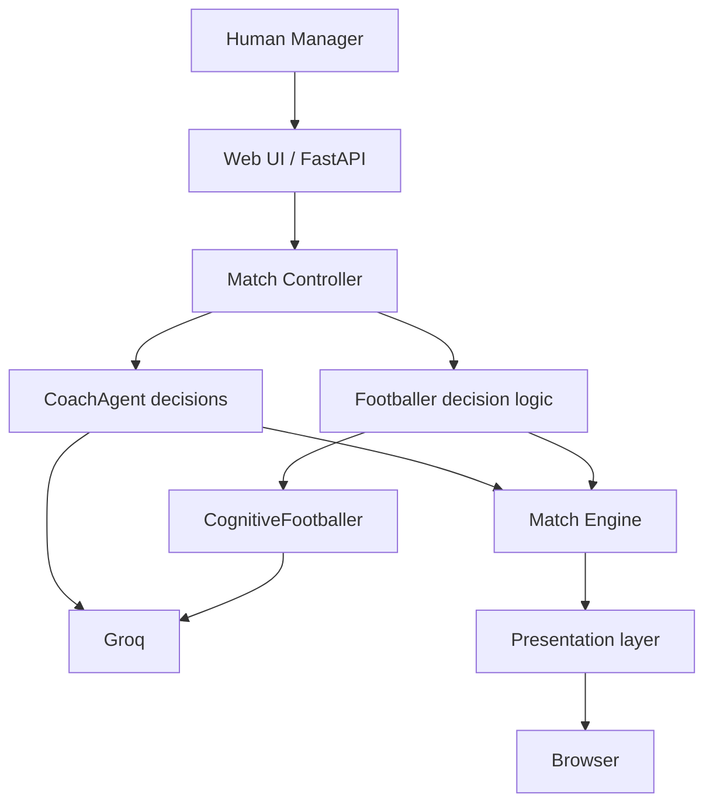

# ARCHITECTURE.md

## Architectural Principle

The `Match Engine` is the center of the system.

Agents do not freely communicate with each other in v0.1.0.

The Match Engine:

1. provides state;
2. requests decisions;
3. validates decisions;
4. resolves consequences;
5. updates state.

## Main Components



## Human Manager

User of the application.

Responsibilities:

* start match;
* inspect state;
* continue to next block.

Not an AI agent.

## Match Controller

Deterministic application code.

Responsibilities:

* manage match phases;
* select and validate deterministic Footballer behaviors;
* invoke Match Engine;
* update score, energy, Match State, and structured events;
* pause between blocks;
* manage match completion.

## Match Engine

Not an AI agent.

Responsibilities:

* calculate strengths;
* apply tactics;
* apply behaviors;
* apply randomness;
* return abstract `CHANCE` and `GOAL` outcomes for one block.

## CoachAgent

One per team.

Uses Groq.

Receives limited Match State.

Chooses one valid team tactic:

```text
ATTACK
BALANCED
DEFEND
```

Output must be structured and validated.

Each Coach is consulted once before each block, for a maximum of four calls per
Coach and eight calls per complete match. Missing configuration, provider
errors, or invalid structured output retain the team's current tactic. Response
ID, model, and raw usage metadata are preserved for later usage tracking but are
not aggregated in this step.

## Footballers

Each team contains 11 starting Footballers.

Internal implementations:

```text
ReactiveFootballer
TacticalFootballer
CognitiveFootballer
```

Exactly one CognitiveFootballer per team uses Groq in v0.1.0. It receives only
its own attributes plus the current phase, score situation, team tactic, team
energies, and previous block result. It returns one validated existing behavior.
If Groq is unavailable or invalid, the existing TacticalFootballer logic selects
the behavior.

The remaining Footballers use Python decision logic.

Each CognitiveFootballer is consulted once before each block, for at most eight
Cognitive calls per match. Together with the two Coaches, the theoretical
maximum is 16 Groq calls per complete match.

## Match State

The Match State must stay small enough to answer:

1. Who is winning?
2. How is each team playing?
3. How much performance capacity remains?

Minimum information includes:

```text
minute
score
team tactic
team strength
average energy
previous block result
```

## Footballer State

Minimum state:

```text
skill
intelligence
stamina
energy
behavior
```

## Match Block Workflow

```text
Pause / Start
      ↓
Read Match State
      ↓
Build limited Coach contexts
      ↓
Coach A and Coach B choose tactics independently
      ↓
Validate and apply tactics
      ↓
Build limited Footballer contexts
      ↓
Reactive, Tactical, and Cognitive behaviors
      ↓
Validate decisions
      ↓
Match Engine simulates block
      ↓
Update score
      ↓
Update energy and Match State
      ↓
Generate events
      ↓
Browser renders block result
      ↓
Human Manager clicks Continue
```

## Match Sequence

```text
Start Match

1–25
↓
Hydration Pause

26–45+5
↓
Half-time

46–70
↓
Hydration Pause

71–90+5
↓
Full-time
```

## Guardrails

Agent outputs must be validated before entering the Match Engine.

Invalid output must never directly affect Match State.

Examples:

* unsupported tactic;
* unsupported behavior;
* missing structured output;
* malformed Groq response.

Fallback behavior must remain deterministic.

## AI Provider

Only Groq is supported in v0.1.0.

Configuration:

```text
GROQ_API_KEY
GROQ_MODEL
```

No provider abstraction is required in v0.1.0.

The required environment variables are loaded from the environment or local
`.env` file. Secrets are never placed in prompts, events, or error messages.

CoachAgent and CognitiveFootballer use Groq JSON Object Mode with explicit
JSON-only prompts. Qwen reasoning output is `hidden`; GPT-OSS instead uses
`include_reasoning=false`. Raw reasoning and unsupported strict `json_schema`
requests are not used. Returned JSON remains untrusted until the existing
Pydantic decision model accepts it. TLS verification stays enabled and uses the
operating system trust store so locally trusted issuer certificates are honored.

The configured v0.1.0 model is `qwen/qwen3.8-27b`. Its centralized pricing entry
uses the published input and output rates for usage estimates.

Provider failures emit concise developer logs containing the agent ID, model,
HTTP status when available, provider error type, normalized category, sanitized
message, and deterministic-fallback outcome. Logs exclude API keys,
authorization headers, prompts, full payloads, and raw model output. Successful
responses clear the agent's prior error state, so browser status can return from
`ERROR` to `CONNECTED` after service recovery. No retries or diagnostic provider
calls are introduced; the maximum remains 16 requests per complete match.

## AI Usage Tracking

Each Match Controller owns one in-memory `UsageTracker`. For every Groq request
actually attempted by a Coach or CognitiveFootballer, it records:

```text
agent
model
input tokens
output tokens
total tokens
cached tokens when available
estimated cost
```

The tracker provides match totals and totals filtered by agent ID or agent type.
Local fallbacks without a provider request create no usage record. Failed
provider attempts are recorded without fabricated tokens or cost.

Token counts come from Groq response metadata. Pricing lives in one application
mapping and estimated cost is calculated independently for input and output
tokens per million. If metadata or model pricing is unavailable, token fields or
cost remain unknown rather than being estimated. Pricing can change and must be
reviewed when the selected model changes; estimated cost is not an invoice or
authoritative billing record.

Tracking has no persistence and sends no data to an external observability
platform.

## Browser Interface

The FastAPI application in `app/main.py` serves one Jinja2 page plus a minimal
JSON API. Plain JavaScript requests the current state and the start, continue,
or reset action; it does not duplicate simulation rules. `WebMatchSession` owns
one in-memory `MatchController` and serializes only the score, phase, team
summary, approved events, latest decisions, provider status, and usage needed by
the screen.

The root `run.py` launcher starts Uvicorn on `127.0.0.1:8000`, waits for the
state endpoint to respond, then opens the default browser. The server and
browser layer do not add persistence, identity, background provider polling, or
new match mechanics.

The Match Engine evaluates each block once. After that evaluation, a small
backend presentation builder assigns seeded display timestamps. A continuous
seeded schedule places narrative moments at variable gaps, generally around 5
to 12 displayed minutes, without resetting at block boundaries. The browser
progressively presents the finalized block result at 2.4 real seconds per
displayed match minute. It delays the visible score until a finalized GOAL entry
is revealed and updates energy only when playback ends.

Game events remain the four domain event types and correspond to simulation
state. Presentation events are narrative-only timeline entries; they cannot
alter score, energy, tactics, probabilities, behaviors, or MatchState. Playback
also performs no agent or provider calls.

The presentation builder inserts a seeded `QUIET_MATCH` entry whenever 15
displayed match minutes pass without any visible feed activity. This inactivity
tracking continues across block boundaries and resets after every game,
narrative, or quiet-match entry.

Narrative selection classifies displayed time as early (1–30), middle (31–70),
late (71–90), or stoppage time. It combines that bucket with whether the
selected team is winning, drawing, or losing at that display timestamp. These
are presentation concepts only and are not added to Match Engine state.

Break preferences are browser state only. `Pause at breaks` defaults to enabled;
when disabled, vanilla JavaScript displays a 15-second countdown and invokes the
existing single-block continue endpoint once. There are no backend timers or
jobs. Full time cannot auto-resume. The disabled `MANAGE TEAM` control is a
presentation placeholder with no route, state, or team-management design.

## Calibration Diagnostics

`scripts/calibrate_matches.py` runs the existing four-block match flow with
seeds `1..N`, explicit local fallback agents, no browser playback, and no Groq
requests. It aggregates outcomes, goal totals, goal buckets, and scoreline
frequencies using only the Python standard library. The runner measures current
behavior and does not change probability bands, modifiers, attributes, or any
other Match Engine value.

For controlled goal-frequency experiments, the runner temporarily replaces the
goal-probability mapping referenced by the diagnostic process inside a guarded
context and restores the original reference in `finally`. Candidate profiles
are not application configuration, never change chance probabilities, and
cannot persist into the browser application or normal Match Engine defaults.

## Technology Stack

```text
Python 3.12+
FastAPI
Pydantic
Groq SDK
HTML
CSS
Vanilla JavaScript
Jinja2
pytest
environment variables / .env
```

Data remains in memory or simple configuration structures.

No database is required.

## Localization

Internal architecture, identifiers and code use English.

User-facing strings must remain separate from game logic.

English is the initial UI language.

Future localization may include:

```text
pt-BR
fr
```

Localization implementation itself is not required for v0.1.0.

## Explicit Architectural Exclusions

Do not introduce in v0.1.0:

```text
LangGraph
RAG
vector database
SQL database
React
TypeScript
Ollama
multiple AI providers
microservices
event bus
complex graph orchestration
free agent-to-agent communication
```
